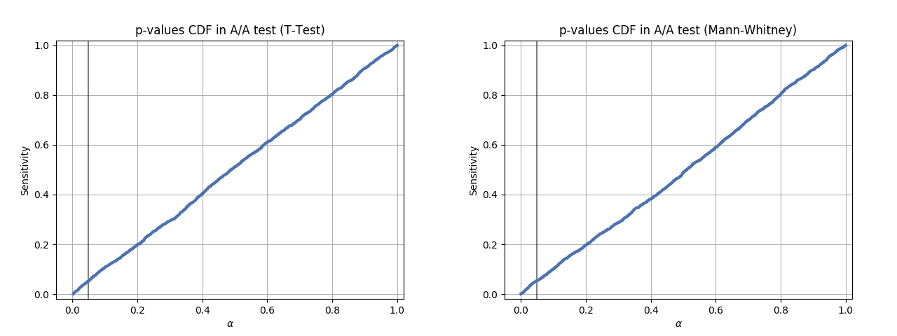

# A/B testing in Tiki Search

In Tiki Search we constantly add new features into ranking formula to provide customers with better search quality. To make sure that a new feature actually gives better result we use A/B testing, which is a process when during some time we have both old and new formula ranking results for a subset of users. Then we calculate key metrics on each of those subsets separately and make a decision whether the new formula is actually doing better or not.

In this article I will give a detailed explanation on the process of making such decision - how to understand that the new ranking is "truly" better than the old one and how to estimate the probability of making a mistake in such decision.

We will not cover the architecture of our whole A/B testing system here - how do we setup the experiments, how do we split our users between them, how do we track events in our system and so on. There’s a lot of information available on these topics. We will solely focus on just one thing - how to interpret the test results and make business decisions based on them.

With all that said, let’s get to the topic.

## Naive Approach

Most of the metrics we use for estimating search quality in Tiki are rate metrics, that can be defined by dividing one value to another value. The most common example of such metric is Click-Through-Rate (CTR), which is defined as the number of clicks divided by the number of impressions made in a certain context. Other rate metrics could be "purchase rate", "non-clicked queries rate" etc. In the rest of the article we will focus on CTR, but everything below can be applied to any other rate metric as well.

For the purpose of this article we will define our "view" event as an impression of a single product made within the search results. Our "click" event will be defined as a click on one of the previously impressed results. And the CTR (for a given customer) will be defined as count of all their "click" events divided by count of all their "view" events.

A naive approach to interpret A/B test results would be to simply compare the average CTR of old and new ranking formula directly and consider the bigger CTR as the "winner". The problem here, though, is that the resulting CTRs will most likely be different even if we didn’t change the ranking formula at all. Different customers have different click behaviour and with such "random" process we will never end up having the same average CTR for the same ranking formula.

Historically we had seen differences in average CTR going up to 2-3% even if the ranking formula behind both test variants was the same. This presumably small difference can actually make a lot of extra money for the company, if it is "truly" there, so we want our testing process to be sensitive to the true changes even smaller than that and throw away all the cases where the improvement was not "truly" there. This means that a direct CTR comparison approach cannot be used.

## Statistical Tests

There’s a number of known ways to solve this comparison problem, they are called "statistical tests".

Let’s define a hypotesis that the CTR distribution of the old ranking model is the same as the CTR distribution of the new ranking model and call it a null hypotesis (H0). Let’s also define an alternative hypotesis (H1) that they are different. A statistical test can perform a calculation over the two distributions and as a result - provide a p-value (probability value), which estimates how likely it is that you would see the difference described by this test statistic if the H0 was true (meaning the actual distributions were the same). It might be hard to understand in theory, but we will show more on this later with examples.

The most commonly used statistical tests in the industry are:
- [T-Test](https://en.wikipedia.org/wiki/Student%27s_t-test)
- [Mann-Whitney U-Test](https://en.wikipedia.org/wiki/Mann%E2%80%93Whitney_U_test)
- modifications of these two above

T-Test is a "parametric test", it requires the data to be normally distributed to be applied (a normal distribution is defined by 2 parameters - `mu` and `sigma`, hence the name "parametric"), but can also work relatively well with other distributions that look similar to normal.

Mann-Whitney U-Test is a "non-parametric test" and can be applied to a much broader set of distributions.

In the rest of the article we will try to answer the question how to select the right statistical test for your specific problem and how to interpret its results correctly.

## CTR Distribution

Here’s how a typical CTR distribution in Tiki Search looks like:


This is a density graph that has specific CTR values on x axis and the number of users that had that specific CTR as their average by y axis. The peaks around 0.25, 0.20 etc are the users who just made a few impressions before clicking what they wanted to find and never came back during the test period - the low number of "views" is the reason why their CTRs seem to be so high.

Note that we splitted the CTRs by users in our distribution, because most of statistical tests work under an assumption that the observations should be independent from each other (and we assume that different Tiki users act independently from each other). We could’ve used search sessions instead of users, but then if the same user did a search twice, the second observation might be dependent on the first one (for example, you search "vegetables", because you haven’t found anything for "cucumber") and thus it might be harder to use statistical tests.

Let’s start with a simple idea - let’s find a way to model the CTR distribution above and generate N distributions like that. We will call it our A1 group. Then let’s do another N distributions using the same parameters and call it A2 group. And finally let’s do another N distributions, but change our parameters with a constant uplift coefficient, so that the average of the distributions in this 3rd group would be slightly higher than in A1 and A2. This will be our group B.

We will use groups A1 and A2 to check that False-Positive Rate (FPR) of our statistical test is below the required threshold. And we will use A1 and B to check that the sensitivity of our test is high enough given the accepted error probability.

An FPR is defined as the probability to decline H0 while it is actually correct (which is bad). And the sensitivity is defined as the probability to decline H0 while it is actually wrong (which is good).

## Modelling the CTR Distribution

It is hard to model the CTR distribution directly, because of those peaks caused by users with low "view" counts. Instead of trying to do that, let’s model it indirectly. Let’s start from the "views". Here’s how a typical views distribution looks like in Tiki Search:


It looks much "nicer" than the CTR one, so we can model it using log-normal distribution. Here’s the python code to do that:

```python
import matplotlib.pyplot as plt
import numpy as np
import seaborn as sns
from scipy import stats

mu = 5
sigma2 = 1.3
N = 1000000
views = np.absolute(np.exp(stats.norm(mu, sigma2).rvs(N)).astype(np.int64) + 1)

p00 = np.percentile(views, 0)
p99 = np.percentile(views, 99)
ax = sns.histplot(views, bins=np.linspace(p00, p99, 50))
ax.set_title('Views, P99 = {}'.format(p99))
ax.set(xlabel = 'Views')
plt.tight_layout()
plt.show()
```


Great! It looks very similar to our real distribution! :)

Now we need to somehow generate our clicks distribution as well. The simplest assumption would be that each user has the same "ground truth" probability to click on the product in search results given that those results are exactly the same. Then we can use that "ground truth" probability to generate our simulated click events. This assumption is far from reality, though. Different users have different click behaviour - some would like to check more results before clicking on one, others would just go for it if the first one looks relevant. Of course, this depends on the query context, but it ALSO depends on the user context.

We can try to estimate our "ground truth" CTRs distribution by using our real historical CTRs, but only taking into account users who made enough "views" before, so that their real CTRs are more likely to be close to their "ground truth" CTRs in search. Here’s how such distribution looks in Tiki Search:


Good way to simulate it is to use beta distribution. It is defined on an interval between 0 and 1 and also its expectation can be expressed only using its two parameters - `alpha` and `beta`. We will use this fact later in the article. If you want a more intuitive understanding on why beta distribution is a good option here, read [this blog post](https://towardsdatascience.com/beta-distribution-intuition-examples-and-derivation-cf00f4db57af). Here's how the expectation is defined:


Let’s write the code to do it:

```python
# expectation of our ground truth CTR, we will use it later to simulate B group
success_rate = 0.02
beta = 100
alpha = success_rate * beta / (1 - success_rate)
N = 1000000
success_rate = stats.beta(alpha, beta).rvs(N)

p00 = np.percentile(success_rate, 0)
p99 = np.percentile(success_rate, 99)
ax = sns.histplot(success_rate, bins=np.linspace(p00, p99, 50))
ax.set_title('CTR, P99 = {}'.format(p99))
ax.set(xlabel = 'CTR')
plt.tight_layout()
plt.show()
```


Note that we have selected the parameters for both simulations above so that they look close to our real distribution graphs, but we will change them later in the article to show which statistical tests work better under which conditions.

Now that we have both views and ground truth ctrs, let’s finally generate our clicks distribution. We can simulate clicks as `views` number of experiments with `success_rate` probability of success using binomial distribution defined like this:

```python
clicks = scipy.stats.binom(n=views, p=success_rate).rvs()
```

Let’s finally write the function to generate our A/A and A/B tests data. For groups A1 and A2 we will just use the same settings for both `views` and `success_rate` distributions. For group B we will change the parameters so that the expectation of `success_rate` has a certain given `uplift`, which represents that users in that distribution tend to click more than in groups A1 or A2. This is the change we want our statistical tests to catch.

```python
import os
import math
import numpy as np
import seaborn as sns
from scipy import stats
from matplotlib import pyplot as plt
from matplotlib.axes import Axes

# generate A1, A2 and B groups with given settings
def generate(N=20000, experiments=2000, mu=5, sigma2=1.3, \
        success_rate=0.02, uplift=0.03, beta=100):
    views_a_1 = np.absolute(np.exp(stats.norm(mu, sigma2).rvs(experiments * N)) \
        .astype(np.int64).reshape(experiments, N) + 1)
    views_a_2 = np.absolute(np.exp(stats.norm(mu, sigma2).rvs(experiments * N)) \
        .astype(np.int64).reshape(experiments, N) + 1)
    views_b = np.absolute(np.exp(stats.norm(mu, sigma2).rvs(experiments * N)) \
        .astype(np.int64).reshape(experiments, N) + 1)

    # ground truth CTR for groups A1 and A2
    alpha_a = success_rate * beta / (1 - success_rate)
    success_rate_a_1 = stats.beta(alpha_a, beta).rvs(experiments * N) \
        .reshape(experiments, N)
    success_rate_a_2 = stats.beta(alpha_a, beta).rvs(experiments * N) \
        .reshape(experiments, N)

    # ground truth CTR for group B (with uplift)
    alpha_b = success_rate * (1 + uplift) * beta / (1 - success_rate * (1 + uplift))
    success_rate_b = stats.beta(alpha_b, beta).rvs(experiments * N) \
        .reshape(experiments, N)

    # clicks distribution
    clicks_a_1 = stats.binom(n=views_a_1, p=success_rate_a_1).rvs()
    clicks_a_2 = stats.binom(n=views_a_2, p=success_rate_a_2).rvs()
    clicks_b = stats.binom(n=views_b, p=success_rate_b).rvs()

    return views_a_1, views_a_2, views_b, \
        success_rate_a_1, success_rate_a_2, success_rate_b, \
        clicks_a_1, clicks_a_2, clicks_b
```

Now for the actual tests we will just use their implementation available in `scipy.stats` package.

```python
# T-Test implementation
def t_test(a, b):
    result = list(map(lambda x: stats.ttest_ind(x[0], x[1]).pvalue, zip(a, b)))
    return np.array(result)

# Mann-Whitney U-Test implementation
def mannwhitney(a, b):
    result = list(map(lambda x: stats.mannwhitneyu(x[0], x[1], \
        alternative='two-sided').pvalue, zip(a, b)))
    return np.array(result)
```

And let's also define a function, which we will use later to draw graphs.

```python
colors = sns.color_palette("deep")

def plot_cdf(data: np.ndarray, label: str, ax: Axes, color: str = colors[0], linewidth=3):
    sorted_data = np.sort(data)
    position = stats.rankdata(sorted_data, method='ordinal')
    cdf = position / data.shape[0]
    sorted_data = np.hstack((sorted_data, 1))
    cdf = np.hstack((cdf, 1))
    return ax.plot(sorted_data, cdf, color=color, linestyle='solid', \
        label=label, linewidth=linewidth)
```

Let’s take A1/A2 test comparison and see how our p-values look like in both T-Test and Mann-Whitney U-Test first:

```python
views_a_1, views_a_2, views_b, \
    success_rate_a_1, success_rate_a_2, success_rate_b, \
    clicks_a_1, clicks_a_2, clicks_b = generate()

ctrs_a_1 = clicks_a_1.astype(np.float) / views_a_1
ctrs_a_2 = clicks_a_2.astype(np.float) / views_a_2
ctrs_b = clicks_b.astype(np.float) / views_b

p_values_t_test = t_test(ctrs_a_1, ctrs_a_2)
p_values_mannwhitney = mannwhitney(ctrs_a_1, ctrs_a_2)

def plot_pvalues(p_values, title):
    fig, axes = plt.subplots(ncols=1, nrows=1)
    p_values_distr = sns.histplot(p_values, bins=np.linspace(0, 1, 20), \
        kde=False, ax=axes, stat='probability')
    axes.set_xlim((0, 1))
    axes.set_title(title)
    axes.set(xlabel = 'p-value')
    plt.tight_layout()
    plt.show()

plot_pvalues(p_values_t_test, 'p-values in A/A test (T-Test)')
plot_pvalues(p_values_mannwhitney, 'p-values in A/A test (Mann-Whitney)')
```


And here’s how CDF (cummulative distribution function) graphs of p-value distribution look:

```python
def plot_pvalues_cdf(p_values, title):
    fig, ax = plt.subplots()
    gr = ax.grid(True)
    xlim = ax.set_xlim(-0.05,1.02)
    ylim = ax.set_ylim(-0.02,1.02)
    ax.axvline(0.05, color='k', alpha=0.5)
    ax.set_xlabel(r'$\alpha$')
    ax.set_ylabel('Sensitivity')
    ax.set_title(title)
    cdf = plot_cdf(p_values, '', ax)
    plt.show()

plot_pvalues_cdf(p_values_t_test, 'p-values CDF in A/A test (T-Test)')
plot_pvalues_cdf(p_values_mannwhitney, 'p-values CDF in A/A test (Mann-Whitney)')
```



We can see that in both tests the p-value is equally likely to be anywhere between 0 and 1, which means that if our acceptable FPR threshold is 5%, then this test will only mistakenly decline H0 in around 5% of all cases. The rest of the cases will show p-value > 5% and thus we will accept H0, because the p-value is bigger than our threshold.

Let’s see on p-values in A1/B test now:

```python
p_values_t_test = t_test(ctrs_a_1, ctrs_b)
p_values_mannwhitney = mannwhitney(ctrs_a_1, ctrs_b)

plot_pvalues(p_values_t_test, 'p-values in A/B test (T-Test)')
plot_pvalues(p_values_mannwhitney, 'p-values in A/B test (Mann-Whitney)')

plot_pvalues_cdf(p_values_t_test, 'p-values CDF in A/B test (T-Test)')
plot_pvalues_cdf(p_values_mannwhitney, 'p-values CDF in A/B test (Mann-Whitney)')
```


And CDF graphs as well:


We can see that both tests did have relatively good sensitivity under acceptable FPR threshold, but Mann-Whitney U-Test had shown better sensitivity than T-Test with the settings above.

Let’s now try to tweak `views` and `success_rate` distributions to simulate different user behaviour and see how it affects the sensitivity and FPR of both tests. We will use `sigma2` parameter to tweak `views` and `beta` to tweak `success_rate`. For the purpose of presentation we will plot all important information in one summary screen and then merge all of them into an animated GIF here.

```python
def plot_summary(data, ground_truth_ctr, views, sigma2, beta):
    cdf_h1_title = 'p-value if H1 is correct (Sensitivity)'
    cdf_h0_title = 'p-value if H0 is correct (FPR)'

    # create layout
    fig = plt.figure(constrained_layout=False, figsize=(3 * 3.5, 3.5 * 3), dpi = 100)
    gs = fig.add_gridspec(4, 3)

    # fill the layout
    ax_h1 = fig.add_subplot(gs[:2, :2]) # sensitivity in A/B
    ax_h0 = fig.add_subplot(gs[0, 2]) # FPR in A/A
    ax_views = fig.add_subplot(gs[1, 2]) # views in A/A
    ax_clicks = fig.add_subplot(gs[2, 2]) # ctr in A/A
    ax_powers = fig.add_subplot(gs[2, :2]) # sensitivity at alpha = 0.05
    ax_fpr = fig.add_subplot(gs[3, :2]) # FPR at alpha = 0.05
    ax_hint = fig.add_subplot(gs[3, 2]) # current parameters hint

    # adjustments
    fig.subplots_adjust(left=0.2, wspace=0.3, hspace=0.4)

    # diagonals at h1 and h0 for simpler comparison
    ax_h1.plot(np.linspace(0, 1, 10000), np.linspace(0, 1, 10000), 'k', alpha=0.1)
    ax_h0.plot(np.linspace(0, 1, 10000), np.linspace(0, 1, 10000), 'k', alpha=0.1)

    ax_h1.set_title(cdf_h1_title)
    ax_h0.set_title(cdf_h0_title)

    ax_h1.axvline(0.05, color='k', alpha=0.5)

    # plot cdf for all
    for title, (ab_pvals, aa_pvals, color) in data.items():
        plot_cdf(ab_pvals, title, ax_h1, color, linewidth=3)
        plot_cdf(aa_pvals, title, ax_h0, color, linewidth=1.5)

    ax_h1.grid(True)
    ax_h0.grid(True)

    ax_powers.set_title('Sensitivity')
    ax_fpr.set_title(r'False Positive rate at $\alpha = 0.05$')
    tests_powers = []
    tests_fprs = []
    tests_labels = []
    tests_colours = []

    for title, (ab_pvals,aa_pvals, color) in data.items():
        tests_labels.append(title)
        tests_colours.append(color)
        tests_powers.append(np.mean(ab_pvals < 0.05))
        tests_fprs.append(np.mean(aa_pvals < 0.05))
    ax_powers.barh(np.array(tests_labels), np.array(tests_powers), color=np.array(tests_colours))
    ax_fpr.barh(np.array(tests_labels), np.array(tests_fprs), color=np.array(tests_colours))

    views_p99 = np.percentile(views[:100].ravel(), 99)
    sns.histplot(views.ravel(),
                 bins=np.linspace(0, views_p99, 100),
                 ax=ax_views,
                 kde=False,
                 stat='probability').set(ylabel=None)
    ax_views.set_title(f'Views, P99 = {views_p99:7.1f}')

    success_rate_p99 = np.percentile(ground_truth_ctr[:100].ravel(), 99)
    sns.histplot(ground_truth_ctr[:10].ravel(),
                 bins=np.linspace(0, success_rate_p99, 100),
                 ax=ax_clicks,
                 kde=False,
                 stat='probability').set(ylabel=None)
    success_rate_std = ground_truth_ctr[:100].flatten().std()
    ax_clicks.set_title(f'Ground truth CTR, std = {success_rate_std:2.3f}')

    ax_hint.axis('off')
    ax_hint.text(0.5, 0.5, f'sigma2 = {sigma2}\nbeta = {beta}', \
        ha='center', va='center', size='xx-large')

    plt.close()
    return fig

def plot_all(N=20000, experiments=2000, mu=5, sigma2=1.3, success_rate=0.02, uplift=0.03, beta=100):
    views_a_1, views_a_2, views_b, \
    success_rate_a_1, success_rate_a_2, success_rate_b, \
    clicks_a_1, clicks_a_2, clicks_b = generate(N=N, experiments=experiments, mu=mu, \
        sigma2=sigma2, success_rate=success_rate, uplift=uplift, beta=beta)
    titles = [
        't-test',
        'Mann-Whitney'
    ]

    ctrs_a_1 = clicks_a_1.astype(np.float) / views_a_1
    ctrs_a_2 = clicks_a_2.astype(np.float) / views_a_2
    ctrs_b = clicks_b.astype(np.float) / views_b

    # debug print
    print(success_rate_a_1[0])

    p_values_ab = [
        t_test(ctrs_a_1, ctrs_b),
        mannwhitney(ctrs_a_1, ctrs_b)
    ]

    p_values_aa = [
        t_test(ctrs_a_1, ctrs_a_2),
        mannwhitney(ctrs_a_1, ctrs_a_2)
    ]

    views_target = views_b
    ground_truth_ctr_target = success_rate_b
    color = colors[0]

    test_data = {}
    for i,j in enumerate(titles):
        test_data[j] = (p_values_ab[i],p_values_aa[i],colors[i])
    pict = plot_summary(test_data, ground_truth_ctr_target, views_target, sigma2, beta)
    name = f'exp={experiments}_N={N}_uplift={uplift}_sr={success_rate}_beta={beta}_sigma2={sigma2}.png'
    pict.savefig(f'{name}')
    return f'{name}'
```

Here's how the result changes for different `sigma2` values:

```python
sigma_list = [0.1, 0.2, 0.3, 0.4, 0.5, 0.8, 1.0, 1.3, 1.5, 1.8, 2.0, 2.5, 3.0, 4.0, 4.5]

for sigma2 in sigma_list:
    plot_all(sigma2 = sigma2)
```


And here's the changes for different `beta` values:

```python
beta_list = [1, 5, 10, 20, 40, 80, 100, 150, 300, 500, 1000, 2000, 10000]

for beta in beta_list:
    plot_all(beta = beta)
```


The U-Test shows better sensitivity in all the cases above, the difference is especially high when `views` distribution is heavily shifted to the left. Another interesting thing to notice is that if ground truth CTR distribution is shifted to the left, both tests' performance is relatively low (but U-Test still outperforms T-Test).

Let’s discuss how can we improve it further!

## Bucketing

A commonly used approach to improve statistical test performance is called "bucketing". Instead taking each user separately and comparing CTR distributions between them we could group users into buckets and compare the CTR distributions between those buckets. The only requirement here is that each user should only belong to one bucket. This can be achieved by using hashing with salt technique.

Let’s write a function to bucketize a given distribution and also wrappers to apply both statistical tests to a bucketed distribution:

```python
def bucketize(ctrs_0, weights_0, ctrs_1, weights_1, bucket_size=10):
    n_experiments, n_users = ctrs_0.shape
    n_buckets = math.ceil(n_users / bucket_size)
    values_0 = np.zeros((n_experiments, n_buckets))
    values_1 = np.zeros((n_experiments, n_buckets))
    for b in np.arange(n_buckets):
        ind = np.arange(b * n_users / n_buckets, b * n_users / n_buckets + n_users / n_buckets).astype(np.int)
        values_0[:, b] = np.sum(ctrs_0[:, ind] * weights_0[:, ind], axis=1) / np.sum(weights_0[:, ind], axis=1)
        values_1[:, b] = np.sum(ctrs_1[:, ind] * weights_1[:, ind], axis=1) / np.sum(weights_1[:, ind], axis=1)
    return values_0, values_1

def t_test_buckets(ctrs_0, weights_0, ctrs_1, weights_1, bucket_size=10):
    return t_test(*bucketize(ctrs_0, weights_0, ctrs_1, weights_1, bucket_size))

def mannwhitney_buckets(ctrs_0, weights_0, ctrs_1, weights_1, bucket_size=10):
    return mannwhitney(*bucketize(ctrs_0, weights_0, ctrs_1, weights_1, bucket_size))
```

We will use the same ranges of `sigma2` and `beta` and draw the same animated series of graphs to see how bucketing performs comparing to the regular tests. Here's the changes for `sigma2`. Modifications to `plot_all` to support bucketed versions of tests are very simple, so we will not provide `plot_all_buckets` code here, but you can find it in [this repository](https://github.com/bachan/articles/tree/master/ab_testing_in_tiki_search_1).

```python
for sigma2 in sigma_list:
    plot_all_buckets(sigma2 = sigma2)
```


And here's the changes for `beta`:

```python
for beta in beta_list:
    plot_all_buckets(beta = beta)
```


While in most cases bucketing doesn't outperform the U-Test and works even worse than the T-Test sometimes, it can be seen that under more "regular" ground truth CTR distributions when `beta` is high, it shows the best performance among all tests. Let's try to simulate the distributions where the improvement with bucketing would be more visible.


We will leave the question of why bucketing works behind this article. We will also leave behind the question of how to pick the size of the bucket - it heavily depends on the actual distributions and the best way to pick it is to run similar tests on your own distributions and see what gives the best results.

## The Real Data

All the tests above were made on simulated distributions, but we can actually generate any number of A/A tests from our real data, we just need to make sure that the way we split users is independent of any ongoing test, so that the ranking behind them is exactly the same, or even just take the data from a subset of users that was not under any test at the moment.

Here’s p-value graph for A/A test on 2000 random distributions crafted from our real data:


And here’s the CDF graph for it:


Unfortunately, we cannot do the same for A/B tests, because unlike A/A test we could never know which version was actually better (otherwise, we wouldn’t need an A/B test in the first place), but we can still use our real data A/A test to make sure that FPR is within acceptable limits and we can use our simulated A/B tests above to check which statistical test gives the best possible sensitivity for our distribution.

## Conclusion

The main point of this article was not to give exact answer on what works best and not to give a "silver bullet" solution for all possible cases. What I've tried to do here is to show the technique that everybody can apply to their own distributions to figure out which test appraoch will have the best sensitivity under an acceptable false positive rate for their specific domain.

If simulating the tests as we did above is impossible, then at least you should always make sure to check how your statistical tests work with your real data A/A test and make sure that false positive rate is within the limit. Cases when users were splitted incorrectly between the test variants are not uncommon in the real world A/B testing and doing such checks is one of the ways to catch this thing as well.

## What’s next?

There’s a number of things that we want to leave behind this article.

First of all, how long should we run the test to guarantee that we will notice the change of X% in the distribution with FPR being within the acceptable limit. The approach normally used here is called Minimum Detectable Effect (MDE), we might provide more details on it in the next article. There could also be some product related limitations here, for example, customer behaviour in Monday is different from Saturday and this can put some additional requirements on the length of the test.

Second thing that wasn’t covered is how to work with non-rate metrics. For example, we want to optimize an average paycheck from search or increase the share of users with purchases of at least 100k VND of goods. We hope to put some light onto it in the next article.

Third, there’s another popular technique to perform a statistical test called bootstrapping. It is a little more complex (both computationally and in implementation) than the techinques described above, but it might be the best option for some distributions. It is also available in `scipy.stats` package, so you can do your own research.

Apart from these, we’ve tried to cover as much as we can on the process of making decisions about A/B test results that we use in Tiki Search. Hopefully, it was helpful and easy to understand.

## References

The idea of testing and most of the code was taken from [this webinar](https://youtu.be/ObzlKVCiBqI). It's in Russian language, but jupyter notebook with full code is available there.

Full code for this article is also available in [this repository](https://github.com/bachan/articles/tree/master/ab_testing_in_tiki_search_1).

