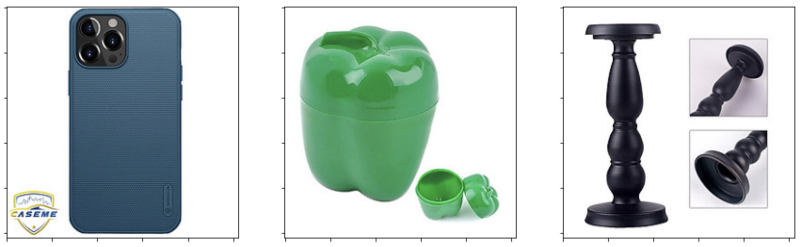
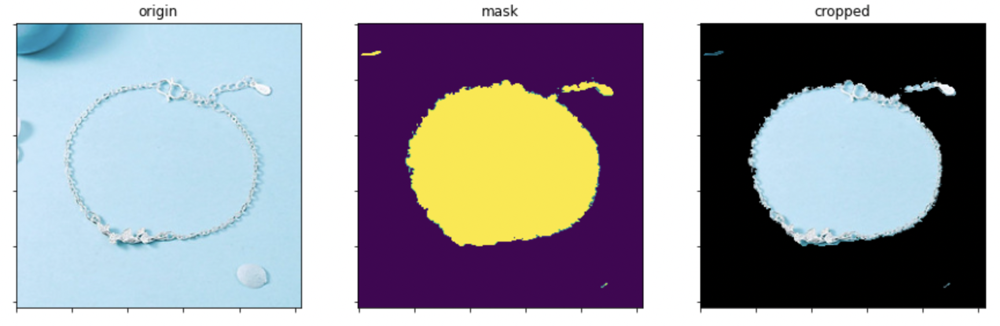
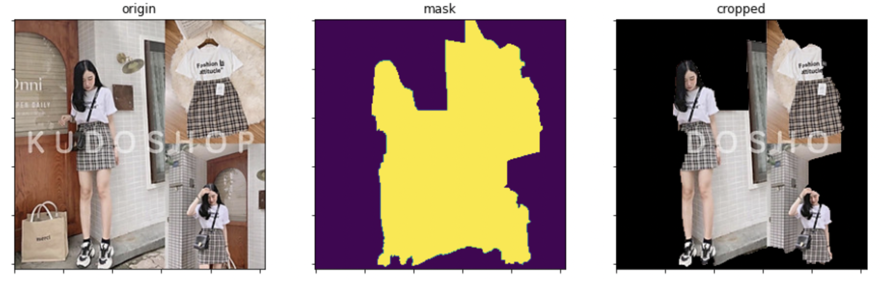

# Color Detection in Tiki Search

Queries that mention color in Tiki Search together with usage of the corresponding "color" filter accomodate to around 2% of the total search volume in Tiki. We want to address that volume in a relevant way for our customers, so that if specific color was requested, we would only show products of that color in our results.

While the statement above sounds simple, it is in fact a complex problem that requires a set of multiple approaches combined to solve it. In this article we will explain how did we solve this problem in Tiki.

Here's what we have at our disposal:

1. Sellers can create multiple variations of their product within the same product entity. For example, if they sell a phone case for Samsung Galaxy M31, they can create a variation for each specific design of the case to let customers choose the design they like on the Product Detail Page. One of such variations could as well be product color and in this case sellers are required to provide a free text color tag for each of the variations.

<https://tiki.vn/op-lung-dien-thoai-samsung-galaxy-m31-01301-silicone-deo-hang-chinh-hang-p58006022.html?spid=58006038>

2. While the above is an option, sellers are not obligated to do such variations, they can also upload products of each color as separate entities and in that case they are not required to provide any color tags.

<https://tiki.vn/op-lung-dien-thoai-samsung-galaxy-m31-silicon-deo-0156-brown05-hang-chinh-hang-p82969564.html?spid=94275326>

3. Freetext color tags provided by sellers can range from something generic and easy to understand like "Xanh lá" to something that is much harder to process automatically (TODO add 3 examples).

4. Customers also may address colors in very different ways in their queries (TODO add 1 good and 3 bad examples).

Our task here is to come up with an approach that will help us to match product color data from our sellers with what our customers use to address those colors in their queries.

This article is going to tell about how did we split this big problem into smaller ones and how did we use machine learning to solve all of them.

## The Three Problems

Our ultimate goal with the seller side part is to be able to detect the color for 100% of our catalog with reasonable accuracy. The only information we have that can tell us about colors is color variation tags set by sellers, which we supposedly trust; and also full set of product images, that sellers upload to represent their selection. So we naturally think about 2 separate problems here:

Problem 1: How do we detect color for each uploaded product image?

Problem 2: How do we use product image colors to make a decision about the actual product's color?

From customer side we have their query texts, so here comes the problem number 3:

Problem 3: How do we tell if a query means looking for products of a specific color and what is that specific color (if any)?

With that being said, let's jump to our solutions one by one.

## Product Images: Naive Approach

The most naive approach to detect product color by its image is to define a set of human understandable color tags like ["Trắng", "Đen", "Vàng", "Đỏ", ...] with their corresponding RGB values and use euclidean distance in RGB space to map each pixel of an image to one of those tags. Then count how many pixels each color tag takes on the image and say that the tag that takes the biggest space is the tag that corresponds to the product's color on that image.

This approach works relatively well with images like these with uniform color and large area:



But it fails to do the job on images with more complex background:


To improve that we've tried to use a well-known GrabCut algorithm that helps to efficiently separate the background and the foreground pixels on any given image. 


More details on the algorithms can be found [here](https://docs.opencv.org/3.4/d8/d83/tutorial_py_grabcut.html).

```
std::vector< cv::Mat > preprocess_image(const cv::Mat &image, size_t width, size_t height)
{
    size_t border = 2;
    size_t border2 = border * 2;

    if (width <= border2 || height <= border2)
    {
        return {};
    }

    cv::cvtColor(image, image, cv::COLOR_RGBA2RGB);

    cv::Rect rectangle(border, border, width - border2, height - border2);

    cv::Mat result;

    cv::Mat bgModel, fgModel;

    cv::grabCut(image,// input image
                result,// segmentation result
                rectangle,// rectangle containing foreground
                bgModel, fgModel, // models
                1,// number of iterations
                cv::GC_INIT_WITH_RECT); // use rectangle

    cv::compare(result, cv::GC_PR_FGD, result, cv::CMP_EQ);
    cv::Mat foreground(image.size(), CV_8UC3, cv::Scalar(255, 255, 255));
    image.copyTo(foreground, result); // bg pixels not copied

    return {foreground, result};
}
```

Using GrabCut yielded surprisingly good results in terms of throwing the background out of scope, but the way we were selecting the main color was still too simple to work correctly with the cases like these:






Overall with our set of images these 2 naive approaches led to around 40% accuracy without GrabCut and around 55% after GrabCut was included (over a set of 13 detectable colors).

## Product Images: Convolutional Neural Network Approach

With the 2 naive approaches above one thing that was left completely out of consideration is the color labels that our sellers are required to set to some of their images. The problem with those labels though is that they are relatively noisy. There's 2 types of noise there:

1. The color picked by the seller is simply incorrect for the provided image.
2. The color DOES make sense if you compare the given product variation to other variations of the same product, but it doesn't make sense from search perspective, when this product is compared to the rest of Tiki selection.

Here's an example of type 2 noise:


A number of heuristics were implemented to automatically clean up the data provided by sellers. Those heuristics ranged from simple corner case checks (i.e. check that the images labelled with different colors by the same seller are actually different) to more complex constructions that relied on internal Tiki catalog structure knowledge. In the end we managed to come up with a training set of around 20-30k images per label with around 5% of noise within each labelled subset. We also manually cleaned up a separate testing set of around 2k images per label for future testing.

Having all the above, a simple CNN model was designed and tested and even from the first try we saw the accuracy going up to 65%. The final model that we ended up releasing was giving 83% accuracy on a noisy test set and 92% on the cleaned up testing set. Here's the architecture we used for our last version:

```
model = Sequential([
        layers.experimental.preprocessing.Rescaling(1./255, input_shape=(img_size, img_size, 3)),

        layers.Conv2D(filters=64, kernel_size=3, activation='relu'),
        layers.BatchNormalization(),
        layers.Conv2D(filters=64, kernel_size=3, activation='relu'),
        layers.BatchNormalization(),
        layers.Conv2D(filters=64, kernel_size=5, strides=2, padding='same', activation='relu'),
        layers.BatchNormalization(),
        layers.Dropout(0.4),

        layers.Conv2D(filters=128, kernel_size=3, activation='relu'),
        layers.BatchNormalization(),
        layers.Conv2D(filters=128, kernel_size=3, activation='relu'),
        layers.BatchNormalization(),
        layers.Conv2D(filters=128, kernel_size=5, strides=2, padding='same', activation='relu'),
        layers.BatchNormalization(),
        layers.Dropout(0.4),

        layers.Conv2D(filters=256, kernel_size=3, activation='relu'),
        layers.BatchNormalization(),
        layers.Flatten(),
        layers.Dropout(0.4),
        layers.Dense(num_classes, activation='softmax')
    ])
```

Few interesting facts about this model:

- On a noisy test set the cases when the model gives the wrong answer are mostly mislabelling and not the actual mistake.

- On a cleaned up test set most of the wrong answer cases are the cases when product color is somewhat controversal (i.e. it's a mix between Cam and Kem, for which it's hard to tell whether it's more Cam or more Kem).


- We originally had "Xanh dương" and "Xanh da trời" separated in our training set, but after a few tries we noticed that every model would completely mess them up in the confusion matrix, which means that sellers themselves didn't have an agreed vision on which one is which. To our understanding, "Xanh dương" is on a darker side while "Xanh da trời" is on a lighter side, but many sellers probably saw it as opposite, so in the end we decided to just join those 2 labels into one.


It is possible to improve our 92% accuracy result even further using bigger image sizes, larger architecture and transfer learning and we can still do it within our current performance constraints, which are not too tight anyway as all detection happens offline when the images are first uploaded by the seller. But this discussion goes beyond this article.

## Product Colors: Merging Images Together (Not Easy)

tell about collecting all detected images into final product color here (and all related problems)

## Queries: ...

tell how we detect color related queries

## Conclusion

...

## References

...

## We're Hiring!

...


